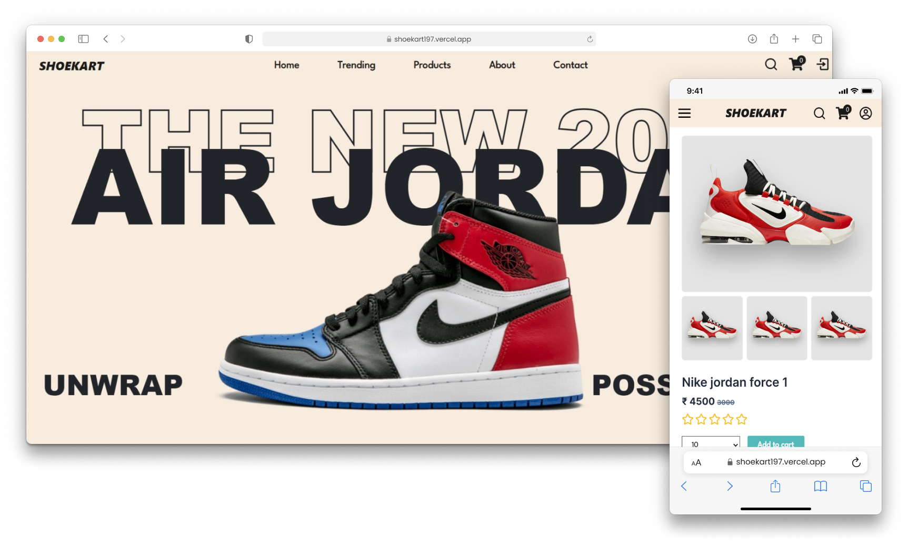

# Shoekart

Welcome to Shoekart – where style meets comfort! Shoekart is an e-commerce platform dedicated to buying shoes, built on the MERN (MongoDB, Express.js, React.js, Node.js) stack. Shoekart not only provides a user-friendly interface for customers to browse and purchase shoes but also includes an admin section for managing products, orders, and users. Additionally, it features a secure payment section powered by Stripe.

## Technologies Used

- **React.js**: Frontend library for building the user interface.
- **Node.js**: JavaScript runtime environment for running server-side code.
- **Express.js**: Backend framework for handling HTTP requests and routing.
- **MongoDB**: Database for storing products, user information, and orders.
- **JWT (JSON Web Tokens)**: Used for user authentication and authorization.
- **Axios**: Promise-based HTTP client for making AJAX requests from the frontend to the backend.
- **Stripe**: Payment processing platform for securely accepting payments online.